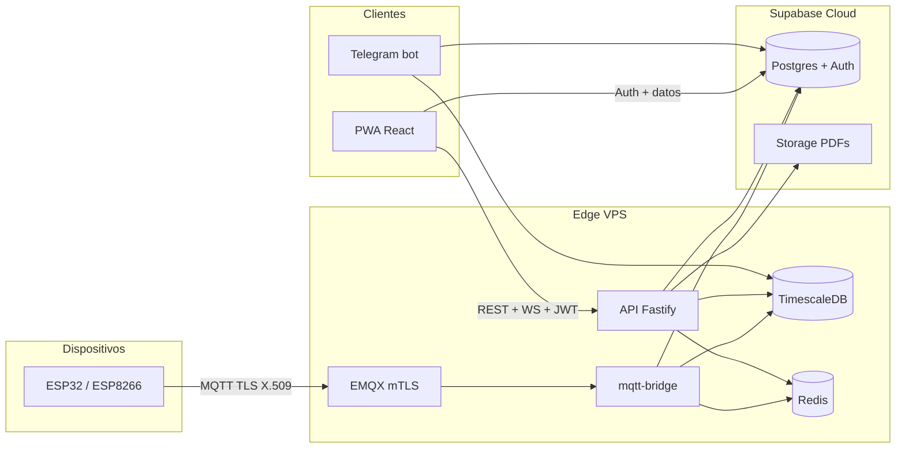

# Arquitectura WCreation

## Vista lógica

## Decisiones clave (ADRs resumidos)

1. **Híbrido de datos**: series temporales (`readings`, `events`, materializados) en **TimescaleDB** en el VPS; tablas operacionales multi-tenant y **RLS** en **Supabase** para alinear con Auth y Storage.
2. **MQTT con mTLS**: identidad del dispositivo = CN del certificado; el broker usa **CA propia**; el certificado de servidor del broker **no** es Let's Encrypt para que los firmwares embarquen solo la CA de producto.
3. **API en Node 22 + Fastify 5**: REST, WebSocket para dashboard, validación JWT vía JWKS de Supabase, firma de eventos en servidor.
4. **PWA**: build estático servido por **nginx** en producción con CSP estricta; la API restringe **CORS** al origen de la PWA.
5. **Observabilidad v1**: healthchecks, Uptime Kuma, `/metrics` Prometheus en API; sin Grafana hasta escala mayor.

## Red y puertos (producción)

| Puerto | Servicio | Notas |
|--------|----------|--------|
| 80/443 | Traefik → PWA y API HTTPS | Let’s Encrypt |
| 8883 | Traefik TCP passthrough → EMQX | TLS terminado en EMQX |
| 22 | SSH | Solo clave, sin password |
| Interno | Postgres, Redis, EMQX dashboard | Solo red Dokploy |

## DNS (Hostinger)

Registros **A** a la IP del VPS: `wcreation`, `api`, `mqtt`, `mqtt-admin` (y `uptime` si aplica).
